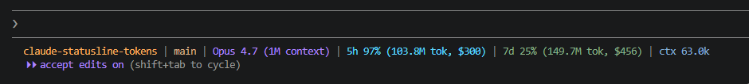

# claude-statusline-tokens

> A Claude Code status line for Windows that shows **percentage, raw token count, and pay-per-token cost** for your 5-hour and 7-day rate-limit windows.

<p>
  
  
  
  <a href="https://Gabriel-Dalton.github.io/claude-statusline-tokens/"></a>
</p>



```
redesign-2026 | main | Opus 4.7 | 5h 42% (1.2M tok, $4.50) | 7d 17% (4.8M tok, $18.20) | ctx 23k
```

**[→ See the full landing page with anatomy + features](https://Gabriel-Dalton.github.io/claude-statusline-tokens/)**

## Why

Anthropic's official rate-limit data, injected by Claude Code into the status-line hook, contains only `used_percentage` and `resets_at` — no raw token counts. Popular packages like [`@owloops/claude-powerline`](https://github.com/Owloops/claude-powerline) therefore render the 5h/7d windows as percentages only.

This script combines both:

- **Percentages** come straight from `rate_limits.five_hour.used_percentage` and `rate_limits.seven_day.used_percentage` (the same numbers Claude Code itself uses).
- **Token totals** are summed locally from `~/.claude/projects/**/*.jsonl` over the rolling 5h and 7d windows. Same approach `ccusage` uses, deduped by `message.id` so multi-block assistant turns don't triple-count.
- **Cost** is computed per-turn at API rates, with the correct cache-write rate (5m vs 1h ephemeral) when the transcript exposes it.

A 20-second cache keeps it snappy (`~/.claude/statusline-tokens.cache.json`).

## What it shows

| Segment | Source |
|---|---|
| working dir | `workspace.current_dir` from the hook |
| git branch | `git rev-parse --abbrev-ref HEAD` |
| model | `model.display_name` from the hook |
| 5h % + tokens + $ | native `rate_limits.five_hour` + transcript scan, costed at API rates |
| 7d % + tokens + $ | native `rate_limits.seven_day` + transcript scan, costed at API rates |
| ctx | input + cache tokens of the last assistant turn in the current session |

If `rate_limits` is missing for a given turn (very rare), the percentage shows `—`; the token totals always render.

## Requirements

- Windows
- PowerShell 5.1 or later (ships with Windows 10/11)
- Claude Code (with `~/.claude/projects/<slug>/*.jsonl` session transcripts — the standard location)
- A terminal that handles 256-color ANSI escapes (Windows Terminal, VS Code's integrated terminal, etc.)

## Install

1. Copy `statusline-tokens.ps1` to `%USERPROFILE%\.claude\statusline-tokens.ps1`.
2. Edit `%USERPROFILE%\.claude\settings.json` and add (or replace) the `statusLine` block — see [`examples/settings.json`](examples/settings.json).
3. Restart Claude Code (or start a new conversation). The status line refreshes on the next prompt cycle.

## Configure

```json
{
  "statusLine": {
    "type": "command",
    "command": "powershell -NoProfile -ExecutionPolicy Bypass -File \"%USERPROFILE%\\.claude\\statusline-tokens.ps1\"",
    "padding": 0
  }
}
```

> **Tip:** if `%USERPROFILE%` doesn't expand in your harness, use the absolute path (e.g. `C:\\Users\\you\\.claude\\statusline-tokens.ps1`).

## Customize

All knobs live near the bottom of `statusline-tokens.ps1`:

- **Colors** — the `$fg*` variables hold 256-color ANSI codes. Swap them for any palette you like ([table](https://www.ditig.com/256-colors-cheat-sheet)).
- **Separator** — `$sep` is the bar between segments. Change to `" • "`, `" / "`, etc.
- **Cache TTL** — `$cacheTtlSec` (default `20`). Lower for snappier feedback, higher to reduce disk reads.
- **Token format** — `Fmt-Tokens` converts raw counts to `1.2M` / `12.3k`. Tweak the thresholds if you want plain numbers.
- **Window lengths** — `$cut5h` / `$cut7d` are computed from `$nowUtc`. Adjust if Anthropic ever changes the rate-limit windows.

To add or remove segments, edit the `$parts +=` lines at the very bottom.

## How it counts tokens

For every `.jsonl` line that contains a `"usage"` block:

1. Parse the ISO timestamp.
2. Skip the line if older than the 7-day cutoff.
3. Skip if the `message.id` (e.g. `msg_011cYfLg7u1svRVTnzarW1ft`) has already been counted — assistant turns log once per content block (`thinking`, `tool_use`, ...) and each entry repeats the same `usage`, so naive summing triples the real number.
4. Sum `input_tokens + output_tokens + cache_creation_input_tokens + cache_read_input_tokens`.
5. Price it: detect the model family from the transcript line and bill input, output, cache-read, and cache-write (5m vs 1h ephemeral) at the right rate.
6. Add to the 7d total; add to the 5h total if the timestamp is also inside the 5-hour window.

Regex extraction beats `ConvertFrom-Json` per line by ~10x on a 20MB transcript pile.

## Caveats

- **Windows-only.** The script uses PowerShell-specific APIs (`[Console]::In`, `[System.IO.File]::ReadLines`, etc.) and assumes the Claude Code projects directory layout. A bash/zsh port would not be hard — feel free to send a PR.
- **Tokens vs. limits.** Anthropic's quota math isn't a straight sum of input + output + cache; cache reads are billed at a discount and cache creation at a premium. The percentages here are the authoritative number for "am I about to hit a limit"; the token totals are an *activity* signal, not a billing prediction.
- **First render after install is slow** (~1s) — PowerShell startup plus a full cold scan of every transcript in `~/.claude/projects/`. Cached renders inside the 20-second TTL skip the scan and take roughly the time of PowerShell startup itself (a few hundred ms).

## License

MIT. See [`LICENSE`](LICENSE).
